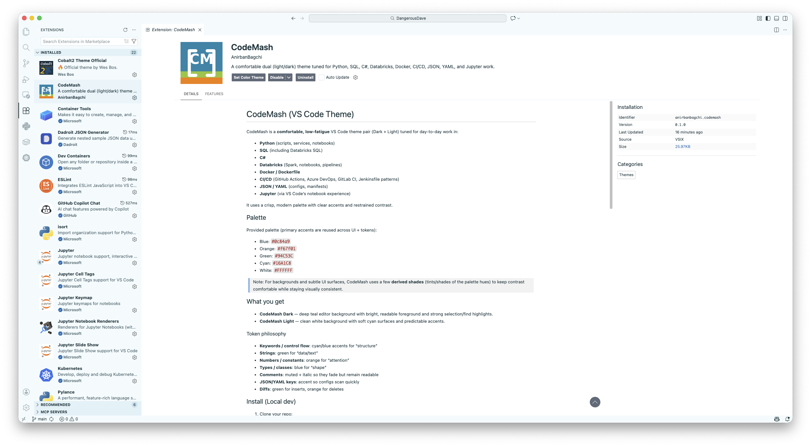
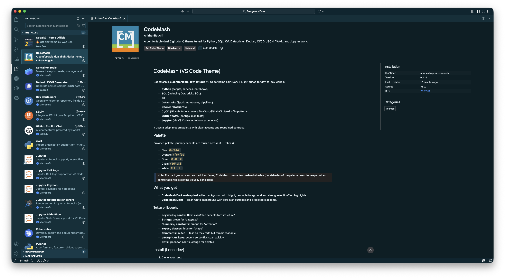

# CodeMash (VS Code Theme)

CodeMash is a **comfortable, low-fatigue** VS Code theme pair (Dark + Light) tuned for day-to-day work in:

- **Python** (scripts, services, notebooks)
- **SQL** (including Databricks SQL)
- **C#**
- **Databricks** (Spark, notebooks, pipelines)
- **Docker / Dockerfile**
- **CI/CD** (GitHub Actions, Azure DevOps, GitLab CI, Jenkinsfile patterns)
- **JSON / YAML** (configs, manifests)
- **Jupyter** (via VS Code’s notebook experience)

It uses a crisp, modern palette with clear accents and restrained contrast.

### Light

---
### Dark


## Palette

Provided palette (primary accents are reused across UI + tokens):

- Blue: `#0c84a9`
- Orange: `#f67f01`
- Green: `#94C53C`
- Cyan: `#16A1C8`
- White: `#FFFFFF`

> Note: For backgrounds and subtle UI surfaces, CodeMash uses a few **derived shades** (tints/shades of the palette hues) to keep contrast comfortable while staying visually consistent.

## What you get

- **CodeMash Dark** — deep teal editor background with bright, readable foreground and strong selection/find highlights.
- **CodeMash Light** — clean white background with soft cyan surfaces and predictable accents.

### Token philosophy

- **Keywords / control flow**: cyan/blue accents for “structure”
- **Strings**: green for “data/text”
- **Numbers / constants**: orange for “attention”
- **Types / classes**: blue for “shape”
- **Comments**: muted + italic so they fade but remain readable
- **JSON/YAML keys**: accent so configs scan quickly
- **Diffs**: green for inserts, orange for deletes

## Install (Local dev)

1. Clone your repo:
   ```bash
   git clone https://github.com/anirbanbagchi/DangerousDave/vs-code-theme/codemash-light-dark-theme.git
   cd codemash
   ```

2. Press `F5` in VS Code to run an **Extension Development Host** window.
3. In the new window, open **Preferences → Color Theme** and pick:
   - `CodeMash Dark` or
   - `CodeMash Light`

## Package & install on your Mac

### Prereqs
- Node.js (LTS)
- VS Code extension packager:
  ```bash
  npm i -g @vscode/vsce
  ```

### Build a VSIX
From the repo root:
```bash
vsce package
```

This produces something like:
- `codemash-0.1.0.vsix`

Install it:
```bash
code --install-extension codemash-0.1.0.vsix
```

## Publish (optional)

1. Update `publisher` and `repository.url` in `package.json`.
2. Create a publisher in the VS Code Marketplace.
3. Publish:
   ```bash
   vsce publish
   ```

## Repository structure

```
codemash-light-dark-theme/
  images/
    icon.png
    screenshot-dark.png
    screenshot-light.png
  themes/
    CodeMash Dark-color-theme.json
    CodeMash Light-color-theme.json
  package.json
  README.md
  LICENSE
```

## Customize

Common tweaks:

- **Make comments brighter/dimmer**:
  - Dark theme: `tokenColors -> Comments -> foreground`
- **Change selection intensity**:
  - Dark: `editor.selectionBackground`
  - Light: `editor.selectionBackground`
- **Notebook look**:
  - Notebook UI inherits from editor/background + list colors. If you want more emphasis, adjust `list.*` and `editorLineNumber.*`.

## Known notes / compatibility

- Language token scopes vary across extensions (Python, C#, SQL, YAML, notebooks).  
  CodeMash uses broad, safe scopes so it looks good across common syntax providers.
- If you use a specialized SQL extension, you may want to add extra scopes under the `SQL identifiers` section in the Dark theme.

## License
MIT
